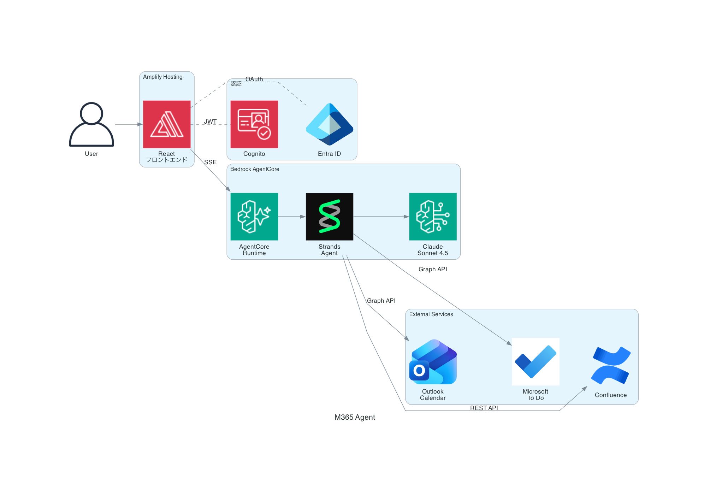

# M365 Agent - あなただけの秘書AIエージェント

チャットで依頼すると、AIエージェントが **Outlook**・**Microsoft To Do**・**Confluence** を操作してくれる秘書アプリです。

## できること

- **Outlook カレンダー** ... 予定の参照、会議の作成（参加者への招待メール送信）
- **Microsoft To Do** ... タスクの一覧取得、作成、更新、完了
- **Confluence** ... ページの取得・検索・作成・更新

## 技術スタック



| レイヤー | 技術 |
|----------|------|
| フロントエンド | React + Vite（Amplify Gen2 Hosting） |
| 認証 | Amazon Cognito + Microsoft Entra ID（MSAL） |
| バックエンド | Amazon Bedrock AgentCore Runtime |
| AIエージェント | Strands Agents + Claude（Amazon Bedrock） |
| IaC | AWS CDK |

## セットアップ

### 前提条件

- AWS アカウント（Bedrock の Claude モデルを有効化済み）
- Node.js 18+
- Microsoft アカウント（M365 Personal でOK）
- Microsoft Entra ID にアプリ登録済み（[手順は docs/development.md を参照](./docs/development.md)）

### 1. クローンと依存インストール

```bash
git clone https://github.com/minorun365/m365-agent.git
cd m365-agent
npm install
```

### 2. 環境変数の設定

`.env.local` を作成:

```bash
# Microsoft Entra ID（Entra のアプリ登録画面から取得）
VITE_MS_CLIENT_ID=xxxxxxxx-xxxx-xxxx-xxxx-xxxxxxxxxxxx
VITE_MS_AUTHORITY=https://login.microsoftonline.com/common

# Confluence（任意。未設定の場合は Confluence 機能が無効になります）
CONFLUENCE_URL=https://your-domain.atlassian.net
CONFLUENCE_EMAIL=your-email@example.com
CONFLUENCE_API_TOKEN=your-api-token
CONFLUENCE_DEFAULT_SPACE_KEY=your-space-key
```

### 3. ローカル開発

```bash
# ターミナル1: Amplify Sandbox を起動（AWS リソースをデプロイ）
export $(cat .env.local | grep CONFLUENCE | xargs) && npx ampx sandbox

# ターミナル2: フロントエンド開発サーバーを起動
npm run dev
```

### 4. 本番デプロイ

GitHub にプッシュすると Amplify Hosting が自動デプロイします。
環境変数は Amplify コンソールで設定してください。

## ドキュメント

- [docs/development.md](./docs/development.md) - 開発ガイド（環境構築の詳細手順）
- [docs/knowledge.md](./docs/knowledge.md) - 開発で学んだ教訓・Tips

## ライセンス

[MIT](./LICENSE)